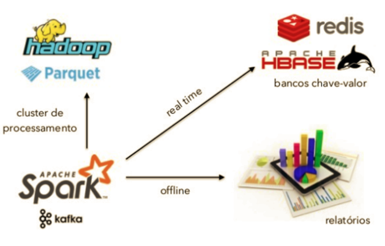
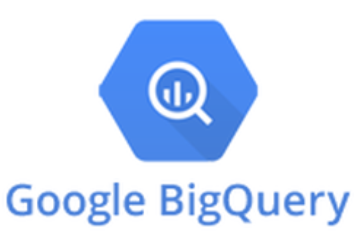

# Big Data na globo.com

<b>Disciplina:</b> Computação Evolutiva

<b>Professor:</b> Dante Augusto Barone

<b>Alunos:</b>
- Augusto Boranga
- Matheus Pereira

O objetivo deste trabalho é apresentar um caso de uso de big data em aplicações do mundo real.

Falaremos a respeito do uso de conceitos relacionados a big data e inteligência artificial nos produtos da globo.com.

## Times

São 6 times de big data:

- Analytics
- Cluster
- Pipeline
- Semântica
- Recomendação
- Growth

## Números

Alguns dados que ilustram a importância e a necessidade de resiliência no sistema de big data:

- 3 bilhões de eventos diários
- 2 milhões de conexões simultâneas
- 50 milhões de usuários únicos por mês
- 100 mil novos conteúdos por mês
- 100 mil recomendações por minuto
- +20 algoritmos de recomendação implementados
- +400 testes A/B

## Sistemas de Recomendação

Uma das principais aplicações de big data na globo.com é nos sistemas de recomendação de matérias, vídeos e notícias.

### Utilidade

Servem para mostrar documentos que possam interessar o usuário, mas que ele não veria normalmente.

### Objetivo

Gerar mais engajamento do usuário (ex.: cliques, tempo online, vendas).

### Modelos

Os modelos de recomendação utilizados na globo.com são:

#### Collaborative Filtering

A ideia por trás deste conceito é encontrar coisas que usuários parecidos comigo viram que eu ainda não vi.

Isso gera uma maior taxa de conversão, mas possui uma atualização lenta, pois é preciso conhecer o usuário.

Esta técnica ficou muito famosa pelo uso na Amazon.

#### Content Based

Aqui a ideia é sugerir conteúdos similares aos que o usuário está consumindo. Isto pode ser mapeado através de palavras-chave, por exemplo.

O ponto positivo neste caso é a sua rápida atualização, uma vez que a sugestão só depende do conteúdo atual.

É o modelo utilizado pelo Spotify para a criação de playlists automáticas.

#### Top

Neste caso, mostra ao usuário os conteúdos mais acessados. Utiliza-se big data neste caso para colher o número de acessos nos conteúdos.

A vantagem deste modelo é que ele pode ser usado quando não sabemos nada sobre o usuário (em uma aba anônima, por exemplo).

## Testes A/B

É um método científico usado para avaliar o desempenho de duas (ou mais) hipóteses entre grupos de usuário.

Um exemplo seria avaliar duas interfaces diferentes para uma página. Os usuários que acessarem a página receberão a versão A ou a versão B da página (sem saber que o teste de desempenho está ocorrendo, para não influenciar nos resultados). Depois de um tempo determinado, avalia-se o quanto cada versão da página gerou de feedback do usuário (cliques, compras, dependendo do caso). A página que tiver maior desempenho "venceu" o teste, por assim dizer.

## Pipeline

O pipeline representa o caminho que os eventos (registros de uma ação como um clique, por exemplo) percorrem desde o usuário até a análise holística dos dados.

## Data Science

Os dados coletados e tratados pelo pipeline devem ser, então, analisados de alguma forma, para que possam fazer sentido.

A ciência dos dados é usada para criar recomendações para o usuário (como descrito anteriormente), testes de desempenho ou insights mais gerais acerca da visão do usuário a respeito do produto.

As ferramentas mais utilizadas para tal análise são:

### Jupyter
Ferramenta open-source para análises estatísticas, utilizando o conceito de programação literária.

<i>http://jupyter.org</i>

### Google Big Query
Ferramenta do google para realizar buscas otimizadas em grandes volumes de dados.

<i>https://cloud.google.com/bigquery/?hl=pt-br</i>
