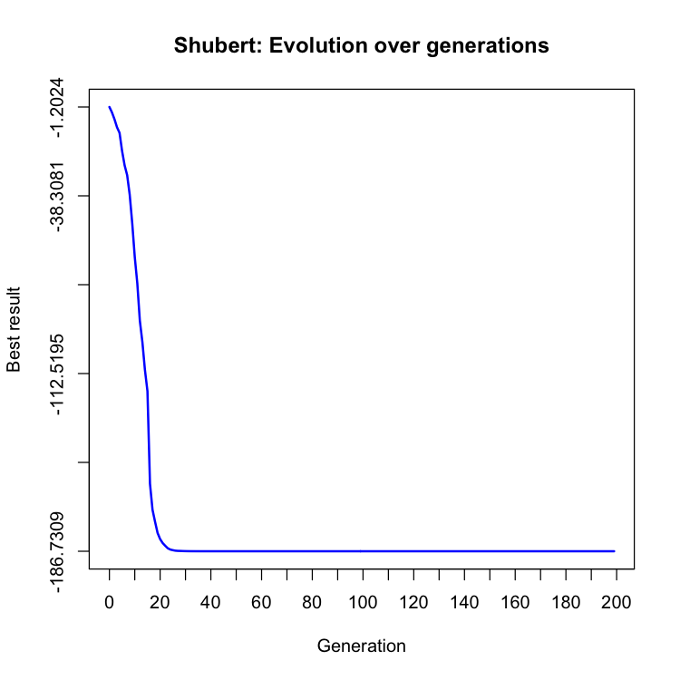
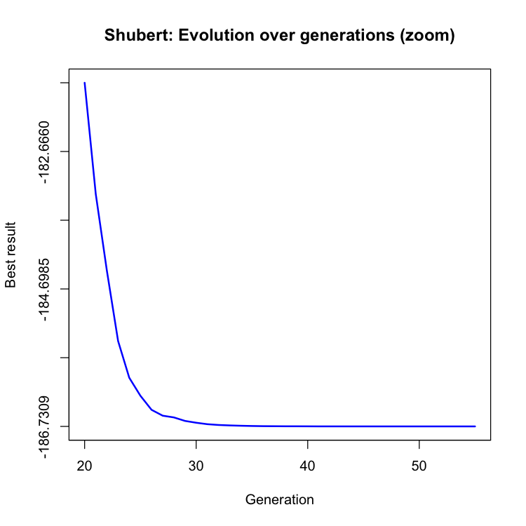
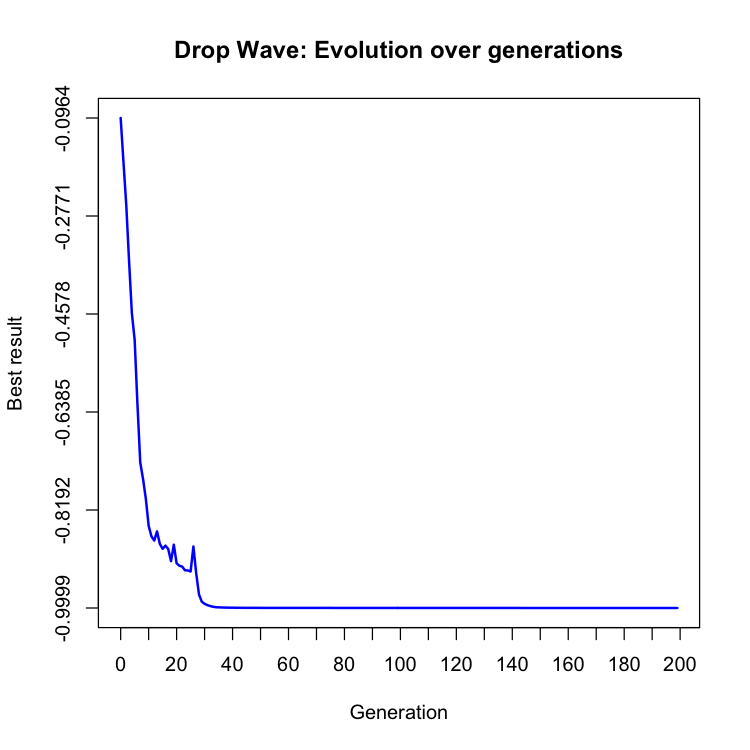
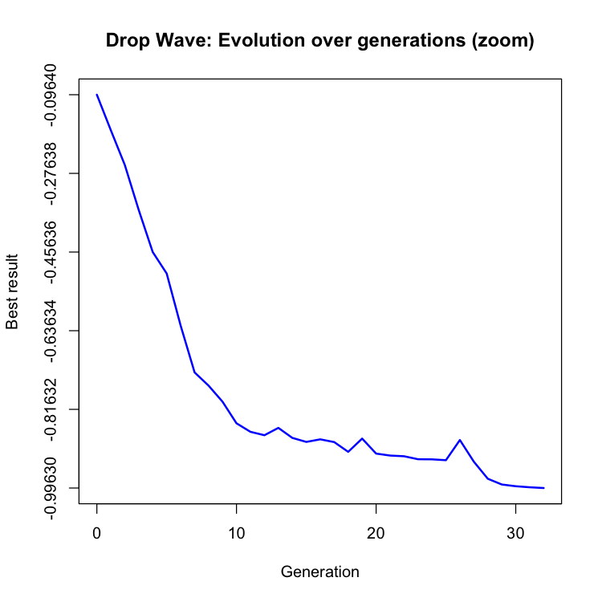

# Algoritmo genético

<b>Disciplina:</b> Computação Evolutiva

<b>Professor:</b> Dante Augusto Barone

<b>Alunos:</b>
- Augusto Boranga
- Matheus Pereira

O objetivo deste trabalho é implementar um algoritmo genético que otimize os problemas escolhidos.

## Problemas escolhidos

- Shubert's function
- Drop wave

## Implementação

Fizemos a implementação tanto das funções de otimização quanto do algoritmo genético em Python, devido à sua adequação ao meio acadêmico.

Para executar o algoritmo para a função de Shubert, basta rodar `python genetic_algorithm.py shubert` pela linha de comando.

Similarmente, `python genetic_algorithm.py drop_wave` executa o algoritmo para a função de Drop Wave.

### População inicial

A população inicial é constituída por indivíduos gerados aleatoriamente: são escolhidos valores aleatórios (ponto flutuante) no intervalo [-5.12, 5.12] para cada atributo (x1 e x2).
 
 

### Geração de filhos

A cada iteração do algoritmo, mantemos uma parte da população e removemos outra parte. Preenchemos o espaço dos elementos removidos com filhos dos elementos mantidos.

Para gerar cada um destes filhos, seguimos o seguinte processo:

- São escolhidos 2 pais aleatórios dentre os elementos da população;
- É feita uma média ponderada dos atributos (x1 e x2) dos pais escolhidos de acordo com o quão bom foi o resultado de cada pai. Estes valores médios são atribuídos ao filho.

O filho é, então, adicionado à população.

### Mutação

O algoritmo percorre a população. Cada elemento possui chance de 30 % de sofrer a mutação explicada a seguir:

- É escolhido um atributo (x1 ou x2) aleatoriamente;
- É somado a ele um valor aleatório entre -1 e 1;
- O valor do atributo alterado é arredondado caso passe do valor máximo ou fique abaixo do mínimo (intervalo [-5.12, 5.12]).

## Resultados

Os resultados obtidos para cada problema foram:

### Shubert

Obtivemos -186.7309 com os valores:

- x1 = -0.1996
- x2 = 0.4251

O valor que obtivemos é o mínimo global desta função. Portanto, conseguimos obter 100 % do valor esperado.
 

### Drop Wave

Obtivemos -0.9997 com os valores:

- x1 = -0.0006
- x2 = -0.0022

O mínimo global desta função é -1. Atingimos aproximadamente 99,97 % do valor esperado.

## Evolução ao longo da gerações

## Referências

### Algoritmo

- https://www.doc.ic.ac.uk/~nd/surprise_96/journal/vol1/hmw/article1.html
- Slides da cadeira de Inteligência Artificial, pelo prof. Bruno

### Funções

- Drop Wave: https://www.sfu.ca/~ssurjano/drop.html
- Shubert: https://www.sfu.ca/~ssurjano/shubert.html
- Gráficos em R: https://www.harding.edu/fmccown/r/
